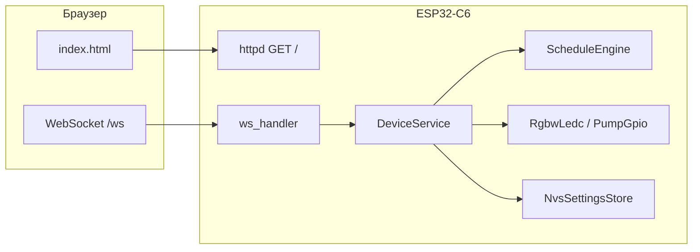

# Архітектура та інтерфейси (українською)

## Доменна модель

Опис структури даних, якою обмінюються планувальник, HAL і веб-протокол (див. також `include/model.hpp`).

### Перелік сутностей

| Сутність | Опис |
|----------|------|
| `SceneMode` | `AUTO`, `MANUAL`, `STORM`, `FEED`, `MOON_TEMP`, `DEMO`, `SHOW_GUESTS` — хто керує світлом зараз. |
| `OperationMode` | `AUTO_24H` або `MANUAL` — відповідає перемикачу «Авто / Ручний» у ESPHome. |
| `LightProgram` | Програма доби: `PLANTS_PRO`, `GROW_ONLY`, `VIEW_ONLY`, `FLUVAL_CLASSIC`, `BRIGHT_DAY`. |
| `Rgbw` | Нормалізовані канали R,G,B,W ∈ [0,1] та загальна яскравість (множник). |
| `DeviceState` | Повний знімок для UI: режими, програма, фаза текстом, канали, помпа, температура, час, Wi-Fi RSSI. |
| `PersistedSettings` | Параметри, що зберігаються в NVS: години розкладу, яскравості, прапорці аклімації тощо. |

### JSON поля стану (тип `state` з сервера)

Приклад логічної структури (реальні імена полів збігаються з `model.hpp` / серіалізацією):

- `operation_mode`, `scene_mode`, `light_program`
- `phase_label` — людочитаний опис фази («Пік», «Луна», …)
- `rgbw` — `r,g,b,w,brightness`
- `pump_on`, `acclimation`, `thermal_throttle`
- `water_temp_c` — може бути `null`, якщо датчик недоступний
- `wifi_rssi`, `uptime_ms`, `time_valid`

### Команди клієнта (WebSocket, JSON)

Усі команди надсилаються як текстовий JSON з полем `type: "cmd"` та `name`:

| `name` | Параметри | Дія |
|--------|-----------|-----|
| `get_state` | — | Повна відповідь `state` |
| `set_operation_mode` | `value`: `auto_24h` \| `manual` | Авто чи ручний |
| `set_light_program` | `value`: рядок enum | Програма доби |
| `set_manual_rgbw` | `r,g,b,w,brightness` | Лише в ручному режимі |
| `set_pump` | `on`: bool | Помпа |
| `set_schedule` | `hour_start`, `hour_end`, `hour_moon_end` | Години для PRO-програми |
| `set_brightness` | `max_brightness`, `brightness_trim`, `moon_brightness` | Як у ESPHome |
| `set_flags` | `acclimation`, `thermal_throttle` | Додаткові множники / обмеження |
| `scene_show_guests` | — | Повна яскравість демо |
| `scene_end_special` | — | Повернення в авто |
| `get_settings` | — | Усі параметри пристрою + блок `mqtt` (без пароля) |
| `set_settings` | `data`: об'єкт полів | Часткове оновлення NVS (режим, розклад, яскравості, manual, прапорці) |
| `set_mqtt_config` | `enabled`, `broker_host`, `port`, `username`, `password` (опційно), `clear_mqtt_password`, `client_id`, `topic_prefix` | Зберегти MQTT у NVS і перепідключити |

### MQTT

- Конфігурація: окремий NVS blob `mqtt_cfg` (`MqttNvsConfig`).
- Підписка: `{topic_prefix}/cmd` — той самий JSON, що й WebSocket (`type: "cmd"`).
- Відповідь на команду: `{topic_prefix}/reply` (QoS 1).
- Періодичний стан: `{topic_prefix}/state` (~4 с), формат `type: "state"`.
- LWT: `{topic_prefix}/status` → `offline` / при підключенні `online` (retain).

Розширення протоколу: додавати нові `name` без зміни URL; версія API — поле `api` у привітальному `hello` після підключення.

## SOLID і шари

- **Інтерфейси (абстракції)** — `include/interfaces.hpp`:
  - `ILightOutput` — виставлення duty RGBW (LEDC).
  - `IPumpOutput` — увімкнути/вимкнути помпу.
  - `ITemperatureSensor` — зчитування °C (заглушка або драйвер).
  - `ISettingsStore` — завантаження/збереження `PersistedSettings`.
  - `ITimeSource` — локальний час + прапорець валідності (SNTP).

- **Планувальник** (`ScheduleEngine`) — одна відповідальність: за годиною й налаштуваннями обчислити цільовий `Rgbw` для авто-режиму.

- **Сервіс пристрою** (`DeviceService`) — координація: застосувати результат планувальника або ручні значення, оновити HAL, сформувати `DeviceState`.

- **Транспорт** (`HttpWsPortal`) — HTTP лише для статики; парсинг команд WS і делегування в `DeviceService` (**розділення UI-протоколу і домену**).

## Діаграма потоків

## Безпека

MVP без автентифікації WS (локальна мережа). Для продакшену рекомендовано: пароль у першому повідомленні, TLS reverse-proxy, або окремий порт з mDNS лише в LAN.
